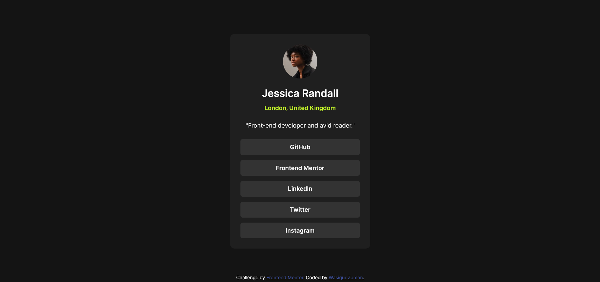

# Frontend Mentor - Social links profile solution

This is a solution to the [Social links profile challenge on Frontend Mentor](https://www.frontendmentor.io/challenges/social-links-profile-UG32l9m6dQ). Frontend Mentor challenges help you improve your coding skills by building realistic projects.

## Table of contents

- [Overview](#overview)
  - [Screenshot](#screenshot)
  - [Links](#links)
- [My process](#my-process)
  - [Built with](#built-with)
- [Author](#author)

## Overview

This is a solution to the [Social links profile challenge on Frontend Mentor](https://www.frontendmentor.io/challenges/social-links-profile-UG32l9m6dQ). Frontend Mentor challenges help you improve your coding skills by building realistic projects.

### Screenshot

### Links

- Solution URL: [Solution](https://www.frontendmentor.io/solutions/social-links-profile-solution-FWfHQmmDuC)
- Live Site URL: [Live](https://wasiqurzaman.github.io/social-links-profile-fementor/)

## My process

### Built with

- Semantic HTML5 markup
- CSS custom properties
- Flexbox

Wasiqur Zaman

- Frontend Mentor - [@wasiqurzaman](https://www.frontendmentor.io/profile/wasiqurzaman)
- Twitter - [@wasiqurzaman01](https://x.com/wasiqurzaman01)
